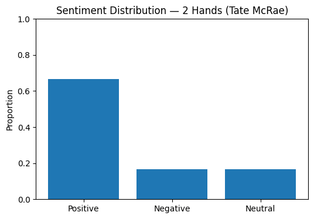
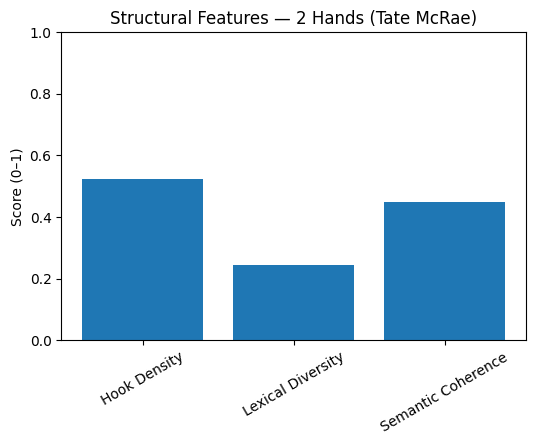
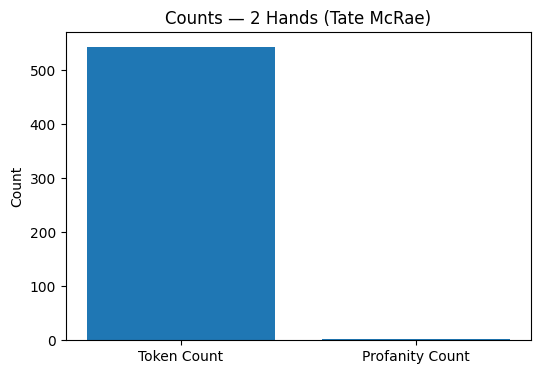

# Model 2 Test Results

**Test 1: Lyric Analysis Validation**

### Input

**Song:** 2 Hands  
**Artist:** Tate McRae

---

### Output

| Feature | Result |
|---------|-------:|
| Positive Sentiment | 0.6667 |
| Negative Sentiment | 0.1667 |
| Neutral Sentiment | 0.1667 |
| Hook Density | 0.5237 |
| Lexical Diversity | 0.2444 |
| Semantic Coherence | 0.4480 |
| Token Count | 543 |
| Profanity Count | 2 |

---

### Output Quality

✅ Successfully classified overall lyrical sentiment.

✅ Extracted lexical diversity and semantic coherence metrics.

✅ Detected hook density using repeated lyrical structures.

✅ Identified profanity occurrences.

---

### Visualizations Generated

- ✅ Sentiment Distribution
- ✅ Structural Feature Analysis
- ✅ Token & Profanity Counts

---

### Integration Status

The extracted NLP features were successfully formatted for:

- Model 3 – Marketing Strategy Generator
- Model 4 – Agentic AI Orchestrator

---

### Ready for Team Integration

✅ YES

## Visual Results

### Sentiment Distribution

### Structural Features

### Token & Profanity Counts

